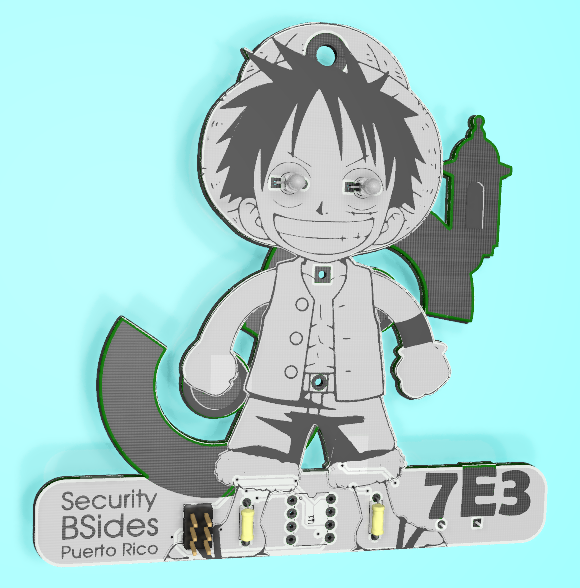

# Badge for BSides PR 2019

This is a DIY badge for all participants, promoting the hand on soldering experience that everyone likes. A security conference is about learning by doing and sharing.

In the spirit of sharing, files in this repo can be used as you please and I expect no retribution.
You and only you are responsible for what you do with this project. Enjoy.

This badge is not a product for sale in any way, it's for sharing and learning. Have a good day.

## 3D Render of the badge
Render from KiCad.

