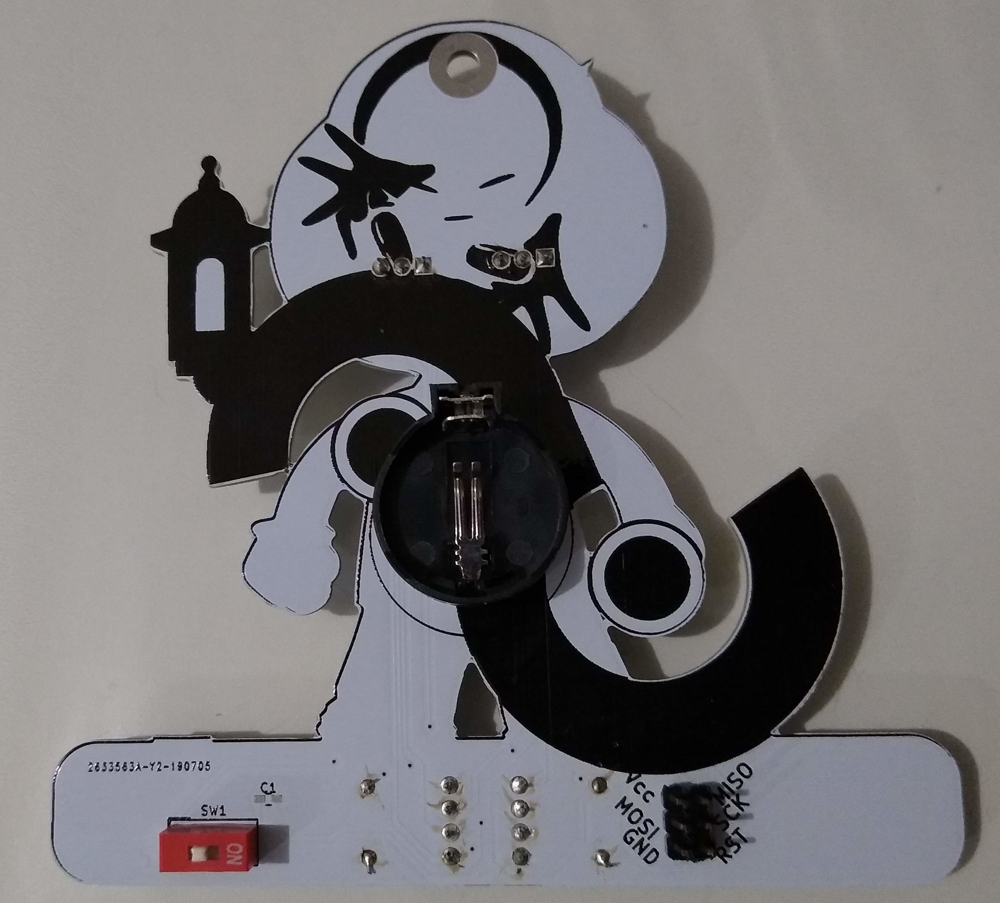
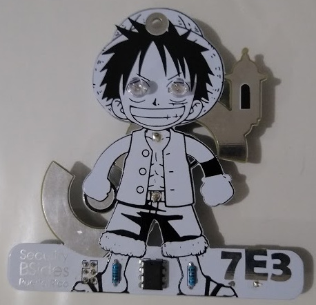
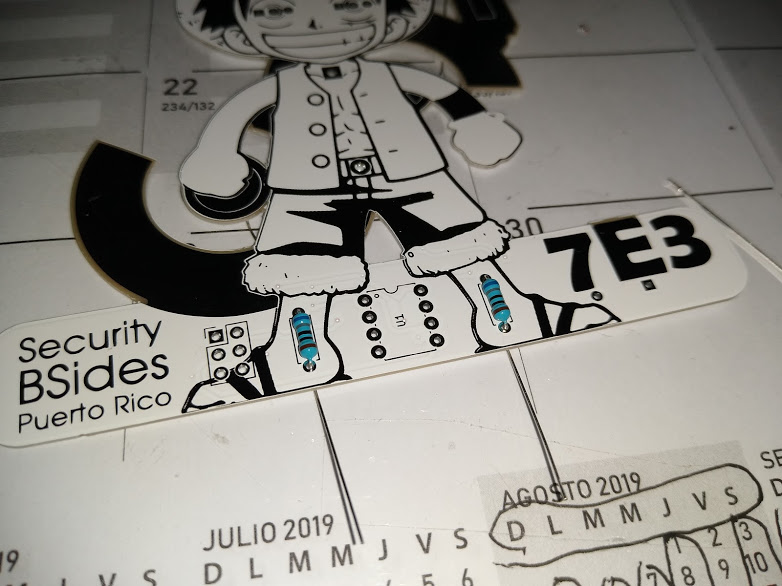
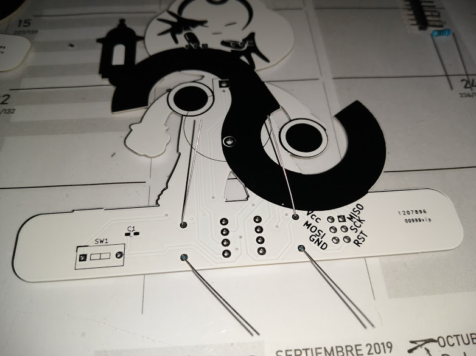

# Overview

Badge for BSides PR 2019. Every year we try to do a diffent badge for our anyal security conference. This badge concept is to provide our comunity with a DIY (Do it your self) badge experience. Badges will be distributed as a kit for the participant to solder and program.

# Project
All design files can be found at [Github repo](https://github.com/soynerdito/BSidesPR_2019_Badge "Badge Repo")

# Components
All Components are easy to mount DIP components. Badge designed to be hand soldered by little to no experiece persons.

Bill of material is:

Qt | Part Number | Description 
-- | ----------- | ----------- 
2 | Led | Two color led (red,blue) 
2 | 680 Ohm | Resistor
1 | | Slide switch
1 | CR2032 | 3V coin cell battery 
1 |  | Baterry Holder for CR2032
1 | Attiny13A | Atty micro controller

# Fully assembly pictures

# Assembly Steps

1. Organize all components from the given bag.
2. Start with soldering the resistors

3. Ensamble leds for the eyes
4. Ensamble the switch
5. Enable the baterry holder

# Programming
Programming the badge can be done using the Arduino IDE.

## Download Arduino IDE
Download Arduino IDE from the official [site](https://www.arduino.cc/en/Main/Software). It is cross platform (windows, mac and linux).

## Configuring Arduino IDE
Follow the guide at http://highlowtech.org/?p=1695
To program the board we need to first burn the Attiny bootloader. That should burn the fuses into the chip to work as expected.

## Sample codes
Download sample codes for the badge

[Police lights](https://github.com/soynerdito/BSidesPR_2019_Badge/ArduinoSamples/PoliceLights)

[Fade](https://github.com/soynerdito/BSidesPR_2019_Badge/ArduinoSamples/LuffyFade)

